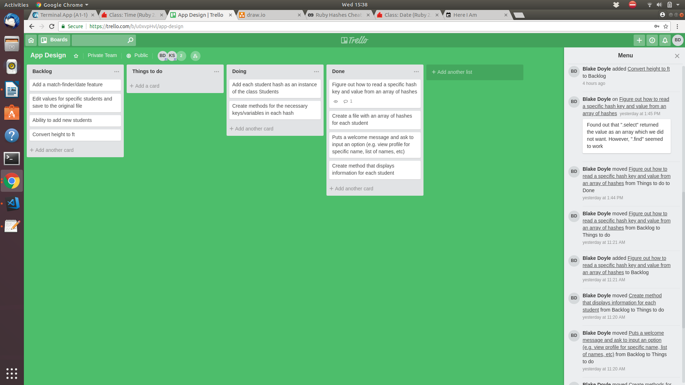
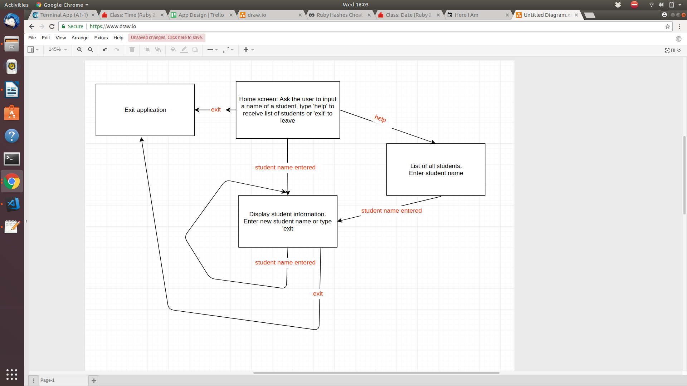

# terminal_app
# terminal_app

Link to repo: https://github.com/ImBlakeDoyle/terminal_app

##########
Purpose: 
Our application is currently for the purpose of entertainment/humour. The values of the application are mostly made up, however there is the possibility to add in specific values to the json file. The application can search through an array of hashes in a json file and can output the values depending on the hash the user has chosen (through looking for a hash with a key value of the user's input). More keys and values can be added to each hash through the terminal and it will update the hashes inside the json file.

##########
Outcome: 
To be able to select a student and display information regarding the specific student from the Coder Academy class.

##########
Functionality: 
The application is very simple and only has a few commands that are necessary to use.

##########
Instructions for use: 
When prompted at the welcome screen, the user can input either a full name of a Coder Academy student, type 'help' to display a list of all students or type 'exit' to leave the application. Once a student name has been entered, fabricated information regarding the student appears and then the user is given the ability to enter in another name to view information for that student, enter 'help' to view the list of students, or enter 'exit' to exit the application.

##########

Initial brainstorm/outline of application:
Create an array of hashes for each student on a .txt file

Create a student class and save each hash in the .txt file as an instance of the class

Each hash has the variable/key ‘name’, ‘age’ & ‘birthday’ with real values. Also has the following varibles/keys with values drawn using the Faker gem &/or random function: ‘favourite food’, ‘bffl’, ‘nemesis’, ‘quote’, ‘from’,  ‘interests’ (can be based off the commonality game + random ones), credit card number, expiry date and CVV

Welcome message to the coder academy database and asks to select an option:
    • Type a name and the profile for that student will come up
    • List all the students and access a student from there
    • !help to show other functions

Display the information of each profile

Have the ability to edit information in a profile and save it back to the file

##########
Concerns:
As a few of the variable values are randomly generated, some students might become upset as the value is more than likely not going to be true in the real world. → Disclaimer at start of program/presentation that a lot of the values are fabricated and the program should be taken as satire.

Lack of security for the application meaning that if someone were to obtain the app, they would be able to view information about specific students.

##########
Complications:
Certain aspects of reading and writing to a json file has proven to be quite difficult. 
Trying to give 3 different variables a value based on 1 array and not using the same value more than once for each was also something we were unable to overcome.
Using each hash in the json file to create an instance of a class.

