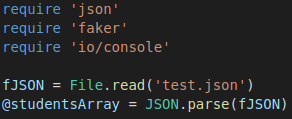
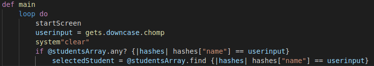
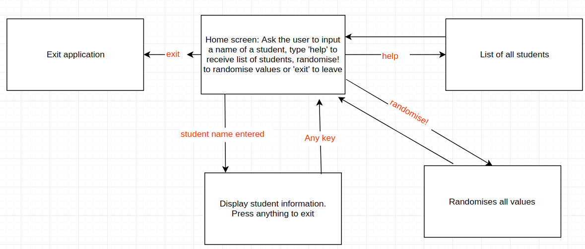
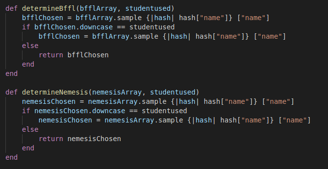
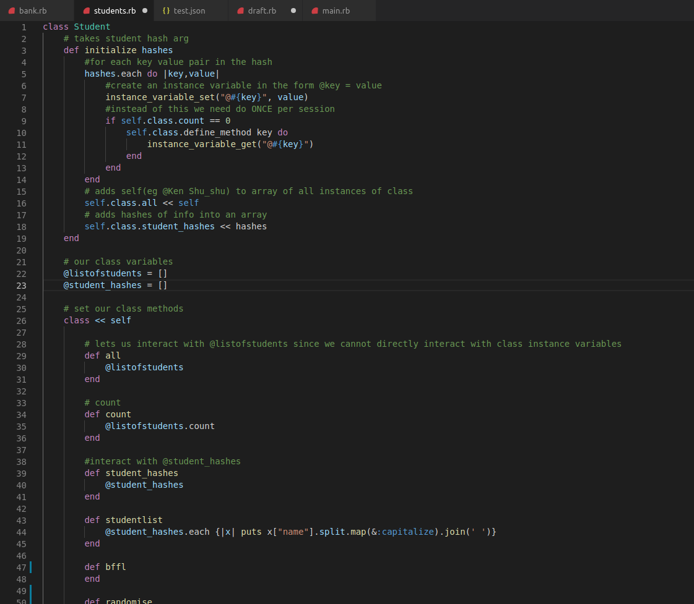

# terminal_app
# terminal_app

Link to repo: https://github.com/ImBlakeDoyle/terminal_app

##########Purpose: 
Our application is currently for the purpose of entertainment/humour. The values of the application are mostly made up, however there is the possibility to add in specific values to the json file. The application can search through an array of hashes in a json file and can output the values depending on the hash the user has chosen (through looking for a hash with a key value of the user's input).

##########Outcome: 
To be able to select a student and display information regarding the specific student from the Coder Academy class.

##########Functionality: 
The application is very simple and only has a few commands that are necessary to use, we overthought the entire application from the beginning. The code begins with the three necessary requirements: json, faker and io/console.

Json is used to read the json file containing an array of student hashes and then to parse that file. 
The methods which represent values for keys in the student hash follow the Json parse. Most of the values used are determined randomly through each method. The help method scans through the array of student hashes and for each hash, finds the values that are stored under the key "name" and prints out those values.

When prompting the user for input, a similar function is used. The application scans through the array of hashes to see if the name the user has submitted is part of the array of hashes. If it returns true, the selectedStudent variable then equals the name which was entered.

##########Instructions for use: 
When prompted at the welcome screen, the user can input either a full name of a Coder Academy student, type 'help' to display a list of all students or type 'exit' to leave the application. Once a student name has been entered, fabricated information regarding the student appears and then the user is given the ability to enter in another name to view information for that student, enter 'help' to view the list of students, or enter 'exit' to exit the application.

##########Initial brainstorm/outline of application:

Create an array of hashes for each student on a .txt file

Create a student class and save each hash in the .txt file as an instance of the class

Each hash has the variable/key ‘name’, ‘age’ & ‘birthday’ with real values. Also has the following varibles/keys with values drawn using the Faker gem &/or random function: ‘favourite food’, ‘bffl’, ‘nemesis’, ‘quote’, ‘from’,  ‘interests’ (can be based off the commonality game + random ones), credit card number, expiry date and CVV

Welcome message to the coder academy database and asks to select an option:
    • Type a name and the profile for that student will come up
    • List all the students and access a student from there
    • !help to show other functions

Display the information of each profile

Have the ability to edit information in a profile and save it back to the file

##########Concerns:
As a few of the variable values are randomly generated, some students might become upset as the value is more than likely not going to be true in the real world.

Lack of security for the application meaning that if someone were to obtain the app, they would be able to view information about specific students.

##########Complications:
Certain aspects of reading and writing to a json file has proven to be quite difficult. 
Trying to give 3 different variables a value based on 1 array and not using the same value more than once for each was also something we were unable to overcome (in the instance of selecting a user name and ensuring that both the bffl & nemesis values were not identical to each other or to the user name).

Using each hash in the json file to create an instance of a class.
We initially thought that we had to use classes, however realised far too late that it was not needed. You can see the unnecessary work in the students.rb file.

#########Future additions:
The attempted implementation of classes in this application snowballed us into more and more errors and failures, so there were quite a few additions we were hoping to have implemented, however we were more concerned on getting the bare bones working properly. We would have liked to have made the application more interactive for the user, with more commands added to perform certain tasks such as the ability to create a new student and have them added to the json file whilst the application is running.

